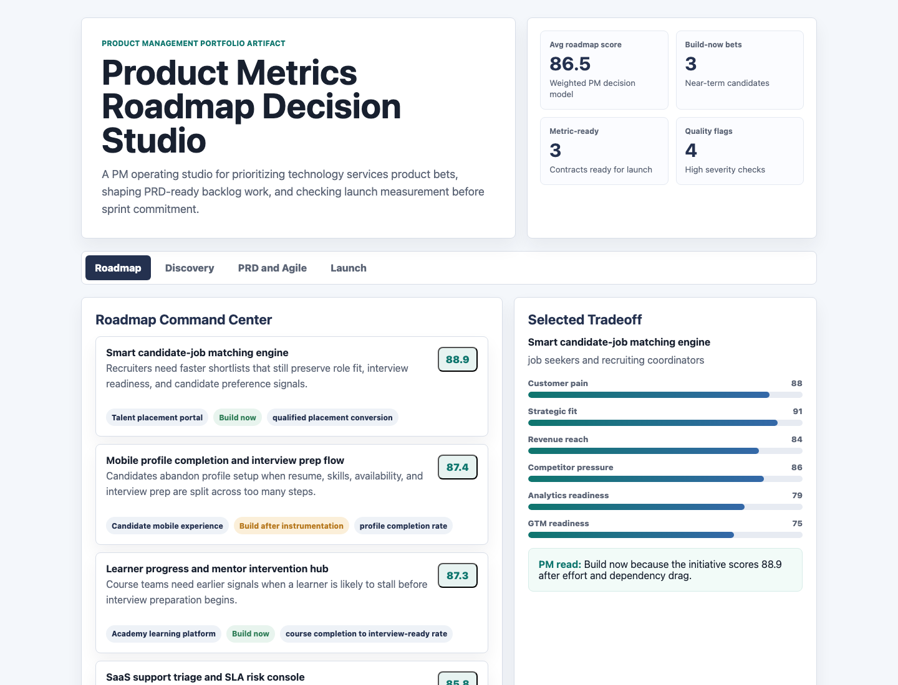
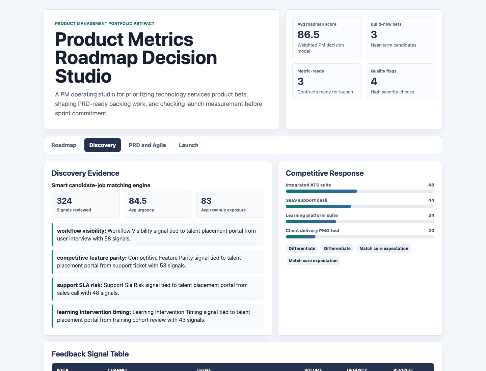
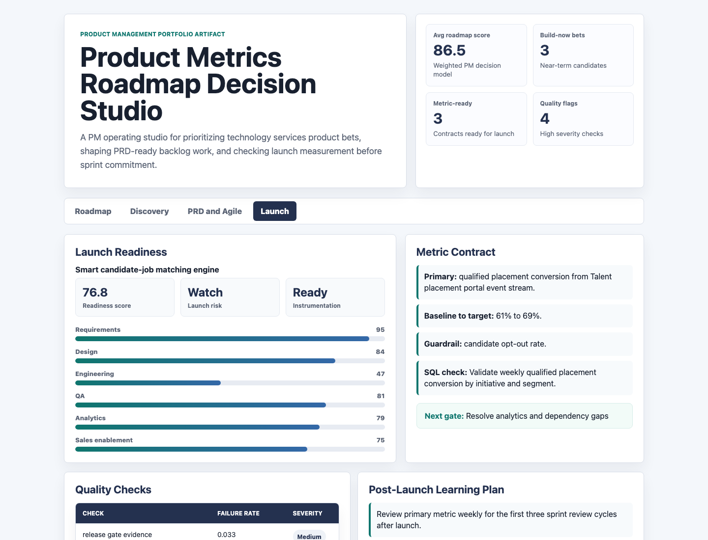

# Product Metrics Roadmap Decision Studio

An interactive Product Manager portfolio artifact for a technology services, training, and SaaS delivery organization. The studio turns customer feedback, market signals, Agile backlog work, release gates, GTM readiness, and product metrics into a roadmap decision packet that a cross-functional team can use before sprint planning or launch review.

## Screenshots



**Roadmap command center:** ranks initiatives by customer pain, strategic fit, revenue reach, competitor pressure, delivery effort, dependency risk, analytics readiness, and GTM readiness.



**Discovery and competitive signals:** connects feedback themes, signal volume, revenue exposure, and competitor gaps so roadmap priority is based on evidence instead of volume alone.



**Launch and measurement readiness:** checks release gates, metric contracts, quality issues, and post-launch learning loops before expanding a product release.

## Why This Artifact Exists

Product teams in technology services organizations often support several product surfaces at once: placement workflows, academy learning tools, client delivery portals, SaaS support experiences, mobile candidate journeys, and executive analytics. A PM needs to make roadmap decisions that balance customer value, delivery capacity, SDLC risk, market pressure, and measurable outcomes.

This artifact demonstrates how to turn that ambiguity into a defensible product operating system:

- Define a product strategy and roadmap from mixed qualitative and quantitative evidence.
- Translate feedback and market research into PRD-ready stories and acceptance criteria.
- Prioritize backlog work with Agile delivery constraints and dependency risk.
- Prepare launch, GTM, analytics, QA, and stakeholder communication plans.
- Use SQL-style validation thinking to protect product metrics before launch.

## What Is In The Project

- `index.html`: interactive browser app with four PM surfaces.
- `src/app.js`: app rendering, tab switching, score visualizations, and tables.
- `src/styles.css`: responsive product workspace styling.
- `data/`: deterministic synthetic source datasets.
- `analysis/outputs/app_payload.json`: scored payload used by the app.
- `scripts/score_operating_data.py`: reproducible data generation, scoring, and documentation script.
- `analysis/sql_checks.sql`: SQL-style checks for roadmap, release, metric, and data-quality review.
- `analysis/executive_findings.md`: concise stakeholder readout.
- `data_dictionary.md`: field definitions.

## Data

All data is deterministic synthetic data generated for this public portfolio artifact. It does not represent real company performance, real users, real candidates, real clients, real courses, real tickets, or production systems.

The synthetic structure is modeled on a technology services business with placement services, training programs, bespoke software delivery, cloud/SaaS support, mobile candidate workflows, and executive reporting needs. The generator creates:

- 6 product initiatives across placement, academy, client delivery, cloud SaaS support, mobile, and analytics surfaces.
- 48 feedback signals from sales calls, support tickets, interviews, product analytics, CSM notes, and training cohort reviews.
- 24 competitor benchmark records using competitor archetypes rather than named vendors.
- 18 backlog stories with user stories, acceptance criteria, sprint plans, owners, and dependencies.
- 6 release-readiness records with requirements, design, engineering, QA, analytics, and sales enablement gates.
- 6 metric contracts with baselines, targets, guardrails, source systems, and instrumentation status.
- 30 data-quality checks and 36 stakeholder update records.

The scoring model uses a transparent weighted formula:

`customer pain 24% + strategic fit 20% + revenue reach 18% + competitor pressure 14% + analytics readiness 12% + GTM readiness 8% - effort drag - dependency drag`

The model is intentionally simple because the role is Product Management, not data science. The point is explainable tradeoff judgment, not predictive modeling.

## Run Locally

```bash
python3 scripts/score_operating_data.py
python3 -m http.server 4173
```

Then open `http://localhost:4173`.

## Scope

This is a static public portfolio artifact. It does not connect to live Jira, Confluence, Aha!, Productboard, Trello, Google Analytics, Tableau, Power BI, Looker, cloud services, mobile telemetry, ATS systems, learning platforms, client delivery portals, support desks, or production databases. It shows how a PM can structure the product strategy, backlog, Agile planning, launch readiness, GTM handoff, and measurement logic for a technology services product portfolio.
