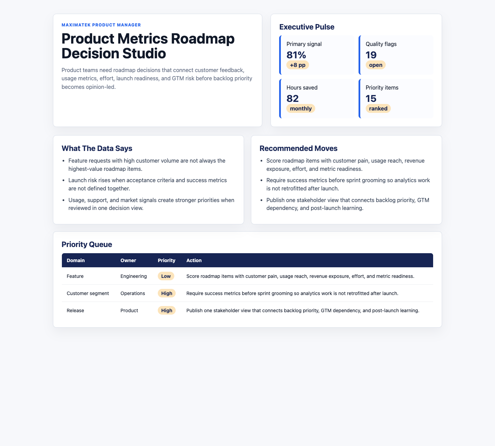

# Product Metrics Roadmap Decision Studio

## Motivation

Product teams need roadmap decisions that connect customer feedback, usage metrics, effort, launch readiness, and GTM risk before backlog priority becomes opinion-led.

This is a practical decision artifact: it includes data, analysis notes, runnable scoring logic, and a visual dashboard that explains what the operating team should do next.

## What Is In The Project

- Browser dashboard in `index.html`
- Six source-style CSV datasets in `data/`
- Analysis profile and recommendations in `analysis/`
- Reproducible scoring script in `scripts/`
- Data dictionary in `data_dictionary.md`
- Screenshot in `docs/images/dashboard.png`

## Data Inventory

- 2,880 daily metric rows across 120 days
- 720 source-system events
- 80 stakeholder requirements
- 360 data quality checks
- 90 prioritized actions

## What The Data Says

- Feature requests with high customer volume are not always the highest-value roadmap items.
- Launch risk rises when acceptance criteria and success metrics are not defined together.
- Usage, support, and market signals create stronger priorities when reviewed in one decision view.

## Analytical Recommendations

- Score roadmap items with customer pain, usage reach, revenue exposure, effort, and metric readiness.
- Require success metrics before sprint grooming so analytics work is not retrofitted after launch.
- Publish one stakeholder view that connects backlog priority, GTM dependency, and post-launch learning.

## Screenshot



## Run Locally

```bash
python3 -m http.server 4173
```

Then open `http://localhost:4173`.
